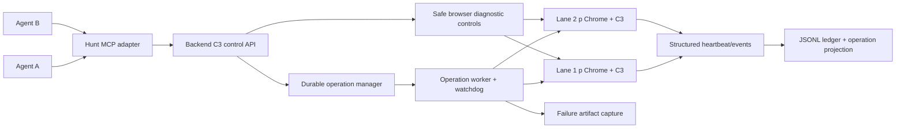

# C3 Agent Testing Control Plane Design

Status: proposed for review

Date: 2026-07-21

Related foundation:

- `docs/superpowers/plans/2026-06-10-c3-agent-command-ledger.md`
- `docs/C3_AGENT_COMMAND_LEDGER.md`
- `docs/C3_PARALLEL_BATCH.md`
- `logs/parallel_2026-07-21_c3_observability_baseline5/current_debug.md`

## Goal

Let multiple agents independently test C3 across multiple isolated browser jobs, detect stalls within a bounded interval, inspect why each field did or did not fill, safely diagnose unfamiliar widgets, and recover without overlapping stale actions or clicking final Submit.

## Consolidated Baseline

Already implemented and retained:

- Append-only redacted JSONL ledger outside repo plus rebuildable Postgres index.
- Agent, lane, session, lease, command, trace, probe, and browser-target identities.
- Session mutation leases, transfer, expiry, and human interruption.
- Browser target registry and Playwright-over-CDP bridge.
- Extension command registry/receiver for 11 C3 commands.
- Generic `hunt_c3_run_command`, seven typed MCP command wrappers, ledger queries, target tools, and probe-file tools.
- Basic extension progress/cancel state, field audit events, p Chrome lane setup, and no-final-Submit rules.
- Hash-chain verifier and probe status lifecycle.

Verified 2026-07-21:

- 98 ledger/MCP/backend-command tests passed.
- Five focused C3 progress/Workday/command-bus tests passed.
- Five CXS-confirmed live Workday jobs ran in isolated p Chrome lanes 9801-9805.

Missing or insufficient:

- Backend bridge call is synchronous for full fill/page-walk commands.
- No durable operation state or event-wait API.
- Progress contains generic message/run ID, not field, driver, popup, commit, or wait state.
- Per-field `Promise.race` timeout does not stop underlying work.
- Page watchdog watches visible DOM signatures, not operation heartbeat.
- Recovery can start while a timed-out action still mutates page.
- Browser diagnosis depends on raw scripts/Playwright and has no stable MCP control contract.
- Probe budgets are advisory; success can mean click attempted, not value committed.
- Failure artifacts are manual and terminal audits can lose partial field traces.
- Batch workflow remains owned by `c3_workday_live_smoke.js`, not MCP operations.
- `Page.bringToFront` can run inside auth helper without explicit permission.
- Successful runner path can keep Node alive after audit completion.

## Live Evidence Driving Design

| Lane | Result | Proven control/diagnostic gap |
| --- | --- | --- |
| Alberta | Review reached | 30-second watchdog fired; old dropdown action committed about 114 seconds after start; recovery overlapped; runner stayed alive after audit |
| People | Hard failure at My Information | Four timeout cycles starved required phone fields; multiple popups remained open; Source probes reported success without committed value |
| Adobe | Hard failure at My Information | Source/Country/Province driver timeouts consumed budget; Email/Phone never ran; terminal audit lacked inner wait cause |
| Intel | Auth/site gate | Hidden noCaptcha wrapper looped five times and was misclassified as generic no-progress |
| Capital One | Hard failure at Application Questions | Offscreen listboxes opened but no option committed; eight required answers blank; field trace lost when outer timeout won |

## Architecture



Backend remains source of orchestration truth. JSONL remains immutable source of audit truth. Postgres remains rebuildable query index. Extension remains source of C3 field decisions and browser-side commit evidence.

## Operation Model

Every agent-visible action creates an operation:

```json
{
  "operation_id": "op_...",
  "command_id": "cmd_...",
  "trace_id": "trace_...",
  "agent_id": "agent_...",
  "lane_id": "lane_...",
  "session_id": "session_...",
  "lease_id": "lease_...",
  "command_name": "c3.page_walk",
  "state": "running",
  "phase": "field_action",
  "substep": "wait_for_owned_listbox",
  "field": {"id": "...", "label_hash": "...", "ui_model": "button_listbox"},
  "driver": "workday_button_listbox",
  "last_heartbeat_at": "...",
  "last_progress_at": "...",
  "cancel_requested_at": null,
  "cancel_acknowledged_at": null,
  "terminal_reason": "",
  "artifact_ids": []
}
```

States:

```text
queued -> running -> completed
                  -> failed
                  -> slow
                  -> suspected_stall -> stalled
                  -> cancelling -> cancelled
                  -> orphaned
```

Rules:

- Start returns `operation_id` immediately; long browser work continues in backend worker.
- Only one nonterminal mutating operation per session.
- Read-only diagnostics can run concurrently.
- Mutating diagnostic actions require valid session lease and no unacknowledged active mutation.
- Retry creates child operation only after previous operation is terminal or cancellation is acknowledged.
- Backend restart marks nonterminal workers `orphaned`; target/run reconciliation decides whether to reattach or fail safely.

## Heartbeat Versus Progress

Heartbeat proves code is alive. Progress proves state changed. They must not be conflated.

Heartbeat payload:

- phase/substep
- field ID/hash and UI model
- selected driver
- awaited condition
- popup/listbox owner
- page URL/step fingerprint
- active run/operation IDs
- elapsed time

Progress payload additionally records one of:

- field focus changed
- option set collected
- target option selected
- backing state changed
- validation changed
- page/step changed
- terminal gate reached

Default thresholds, configurable per driver:

- Heartbeat every 2 seconds during waits.
- No heartbeat for 10 seconds: `suspected_stall` and health probe.
- No heartbeat for 20 seconds: automatic failure bundle.
- No heartbeat for 30 seconds: `stalled`; request cancellation.
- Heartbeats continue but no semantic progress for 45 seconds: `slow`; capture evidence but do not cancel.
- Driver hard deadline defaults to 120 seconds; driver may define lower safe limit.

This separates “slow but alive” from “dead,” preventing current false timeouts.

## Cancellation Contract

Current `Promise.race` returns timeout while original promise continues. Replacement must be cooperative:

1. Every field action receives `operationId`, `fillRunId`, and cancellation token.
2. Every wait loop emits heartbeat and checks cancellation.
3. Every DOM mutation checks token immediately before mutation.
4. Timeout requests cancellation, then waits for `cancel_acknowledged`.
5. Old run IDs cannot mutate after acknowledgment or after newer mutation operation starts.
6. Recovery cannot begin until prior mutation is terminal.
7. Cancellation cause remains accurate: `watchdog_timeout`, `agent_cancel`, `human_override`, `superseded`, or `page_reload`; never collapse all to `user_cancelled`.

## Field Trace Contract

Each field produces a complete bounded trace even on timeout:

```text
field.action.started
field.focused
popup.open.requested
popup.opened
options.collected
option.target_selected
option.action_attempted
commit.check.started
commit.check.completed
validation.checked
field.action.completed|failed|cancelled
```

Required diagnostic fields:

- field ID/hash, redacted descriptor, requiredness, UI model
- driver and fallback method
- element and popup geometry
- `aria-controls`/`aria-owns` owner IDs
- option count and redacted labels/hashes
- chosen option and match reason
- before/after backing state
- commit proof type
- validation before/after
- repair loop number
- elapsed time per substep

## Workday Popup Corrections

Live failures require generic behavior changes:

- Scroll field into view before opening; do not combine `preventScroll` with viewport-only option filtering.
- Resolve options only from popup owned by current field.
- Close sibling/stale expanded popups before and after action.
- Recognize existing selected pill/button state before opening popup.
- Require backing-state commit proof; click completion alone is not success.
- Preserve partial trace when outer page timeout fires.
- Prioritize required fields before optional Province/region fields.

## MCP Surface

Lifecycle tools:

```text
hunt_c3_bootstrap_lane
hunt_c3_start_operation
hunt_c3_get_operation
hunt_c3_wait_for_event
hunt_c3_cancel_operation
hunt_c3_retry_operation
hunt_c3_finish_lane
hunt_c3_fail_lane
hunt_c3_transfer_lane
hunt_c3_heartbeat_lease
```

Dedicated wrappers for all existing C3 commands:

```text
hunt_c3_detect_page
hunt_c3_fill_page
hunt_c3_fill_remaining_with_llm
hunt_c3_page_walk
hunt_c3_click_next_after_fill
hunt_c3_clear_page
hunt_c3_cancel_session
hunt_c3_get_progress
hunt_c3_snapshot_page
hunt_c3_inspect_fields
hunt_c3_inspect_validation
```

Safe diagnostics independent of extension fill loop:

```text
hunt_c3_get_lane_health
hunt_c3_list_tabs
hunt_c3_inspect_page
hunt_c3_inspect_element
hunt_c3_capture_screenshot
hunt_c3_capture_dom_snapshot
hunt_c3_get_console_errors
hunt_c3_get_network_failures
hunt_c3_focus_element
hunt_c3_click_element
hunt_c3_type_element
hunt_c3_press_key
hunt_c3_select_option
hunt_c3_scroll_element
hunt_c3_reload_extension
hunt_c3_reattach_target
```

No arbitrary mutating JavaScript in normal agent mode. Novel-widget probes use explicit untrusted probe capability, lease, budget, reason, and automatic artifact capture.

## Probe Budget

Budget becomes backend-enforced state, not prompt text:

- Budget belongs to session and linked failure command.
- Read-only actions do not consume mutation count.
- Mutation reservation occurs atomically before action.
- Failed opener click still consumes one mutation if page changed.
- Tool rejects actions after budget exhausted.
- Probe result is `ok=true` only when declared proof predicate passes, such as button text/backing value/selected pill/validation transition.
- Every probe begins `trusted=false`; promotion uses existing probe status lifecycle.

## Failure Bundle

Automatic capture on `suspected_stall`, `stalled`, `failed`, and diagnostic request:

- screenshot
- sanitized DOM/accessibility snapshot
- page/step fingerprint
- visible fields and validation
- current C3 operation/progress state
- current field trace
- popup owners and geometry
- console exceptions
- failed/slow network requests
- extension target/worker health
- last 100 operation/session events
- audit checkpoint

Artifacts live under session ledger folder, are hashed, redacted, indexed, and linked by artifact IDs. Capture failure never masks original failure.

## Parallel Lane Control

- Planner validates CSV posting availability before launch. Workday CXS `posted=true` and `canApply=true` is strong proof; 403 is unknown and requires browser check.
- Planner creates queued lane records only; active promotion launches browser.
- Each lane has unique profile, port, browser target, session, lease, and operation set.
- Exact target registration is mandatory; no “latest active tab” fallback for mutations.
- One agent owns one lane mutation lease; many agents may read.
- Batch supervisor monitors health/events and promotes queued lanes when ownership releases.
- Lane report is generated from ledger/artifacts, not buffered stdout.

## No-Focus And Submit Safety

- `Page.bringToFront` rejected unless explicit human `allow_foreground=true` capability exists.
- Batch tools never restore/cascade windows.
- Safe action resolver blocks final Submit-like elements using page state, role, text, and action metadata.
- C3 `allowSubmit=false` remains default and is recorded in every operation.
- Arbitrary mutating probes require explicit capability not granted to ordinary lane agents.

## Legacy Runner

`c3_workday_live_smoke.js` becomes compatibility/reference runner, not workflow owner.

Immediate fixes while migration lands:

- Remove unconditional auth `Page.bringToFront`.
- Close/unref all timers, mail helpers, and CDP clients.
- Exit success path after audit flush.
- Emit audit checkpoints and stdout heartbeat.

After MCP batch runner passes live gates, document legacy runner as deprecated for normal agent testing.

## Failure Classification

Classifier returns one primary category, evidence event IDs, confidence, and next safe action:

```text
posting_unavailable
page_misidentified
auth_no_captcha_gate
auth_validation
extension_unreachable
browser_unreachable
operation_stalled
field_driver_timeout
popup_owner_missing
option_target_missing
commit_failed
validation_blocked
navigation_noop
cancel_not_acknowledged
stale_run_mutation
artifact_capture_failed
human_required
unknown
```

## Rollout

1. Safety and lifecycle fixes.
2. Operation model and MCP lifecycle.
3. Extension heartbeat/cancellation/field trace.
4. Workday popup corrections.
5. Independent safe diagnostics and artifacts.
6. Enforced probes and batch supervisor.
7. Fixture, multi-agent, and real ATS validation.
8. Legacy script deprecation and final docs.

## Acceptance Metrics

- Start operation returns within 2 seconds.
- Agent receives heartbeat within 3 seconds during active field work.
- No-heartbeat stall is visible within 10 seconds and captured within 20 seconds.
- Cancellation acknowledgment arrives within 5 seconds for cooperative waits.
- Zero DOM mutations from stale run after cancellation acknowledgment.
- No second mutation operation starts while first is nonterminal.
- Every failed field identifies field, driver, last substep, popup owner, and commit result or explicit missing evidence.
- Automatic bundle exists for every stalled/failed operation.
- Terminal runner/worker exits within 5 seconds after audit flush.
- Every mutation has agent/session/lease/command/operation IDs and probe-budget accounting when applicable.
- Five concurrent isolated lanes show zero target crossover and zero unapproved foreground actions.
- Final Submit remains untouched in all automated tests.

## Prior Ticket Consolidation

| Earlier tickets | Disposition |
| --- | --- |
| 01-05 bridge core | Keep implemented foundation; rerun live bridge proof |
| 06-09 session orchestration | Consolidate into lane bootstrap, lease heartbeat, finish/fail/transfer, human override |
| 10-13 batch conversion | Replace with planner, MCP supervisor, classifier, enforced fallback probes |
| 14-17 command live tests | Fold into operation and real-browser verification matrix |
| 18-19 artifacts | Expand into automatic failure-bundle contract |
| 20-21 hash/traversal | Keep existing verifier/docs; include in release gate |
| 22-25 real ATS/mixed control | Run after control plane passes fixture tests |
| 26-28 probe lifecycle | Keep status API; add enforced budgets and promotion evidence |
| 29-31 deprecation/runbook/architecture | Finish after live multi-lane proof |

## Non-Goals

- Automatic final job submission.
- Tenant-specific hardcoded Workday fixes.
- Replacing p Chrome isolation/profile launcher.
- Making Postgres authoritative over JSONL.
- Giving normal lane agents unrestricted arbitrary JavaScript execution.
