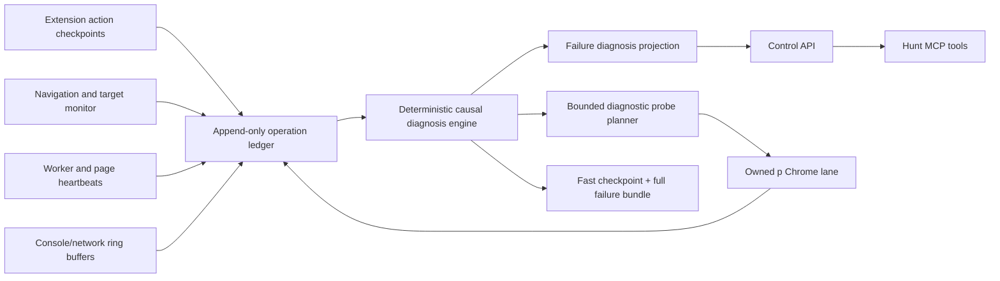

# C3 Causal Diagnostics Design

Status: approved design, written for review

Date: 2026-07-21

Related foundation:

- `docs/C3_AGENT_COMMAND_LEDGER.md`
- `docs/C3_PARALLEL_BATCH.md`
- `docs/C3_LANE_AGENT.md`
- `backend/c3_operation_models.py`
- `backend/c3_operation_monitor.py`
- `backend/c3_monitor_runtime.py`
- `backend/c3_artifacts.py`
- `tools/hunt_mcp/server.py`
- `C:\Users\sushi\Documents\hunt-logs\c3-sequential5-20260721a\current_debug.md`

## Goal

Make every C3 failure produce an automatic, durable, selector-level explanation when evidence proves one, while correctly classifying navigation, external-server, setup, and control-plane failures that have no faulty UI element. Give agents bounded tools to collect missing proof without screen control, target crossover, arbitrary JavaScript, or final application submission.

## Success Definition

An agent should not need to manually reconstruct raw JSONL to answer:

- What failed?
- Where did it fail?
- Was a UI element causal or merely the last touched element?
- What did C3 expect?
- What did the page actually do?
- What evidence proves the conclusion?
- What remains unknown?
- What is the next safe discriminating action?

Every terminal operation gets either a proven/strong diagnosis or explicit `root_cause_unknown`. Absence of proof must never be presented as certainty.

## Evidence Driving Design

| Live result | Current evidence | Missing automatic conclusion |
| --- | --- | --- |
| Finning required resume upload | Selector, validation, and `resume_upload:missing_resume_data` existed | Report did not expose a normalized causal-element diagnosis |
| Salesforce slow auth reload | Probe timeouts, stall timestamps, late page recovery, cancellation acknowledgment existed | Watchdog blamed a stall instead of classifying expected-navigation probe blindness |
| Sun Life/AMA/Orion auth sinks | Exact buttons and redirect chain existed | Reports could imply an element failure even though tenant navigation supplied no rejection reason |
| Shell terms checkbox | Validation and repair trace existed | Terminal report could lose validation details or fail to link late artifacts |
| Artifact timeout cases | Partial or late bundles sometimes existed | Timed-out bundles remained unlinked or absent from terminal report |

## Non-Goals

- Guessing private Workday server decisions.
- Bypassing CAPTCHA, MFA, email verification, or external assessment gates.
- Clicking final job-application Submit.
- Giving lane agents unrestricted DOM mutation or JavaScript evaluation.
- Recording passwords, resume content, full addresses, or typed answer values.
- Replacing the append-only ledger or p Chrome lane isolation.
- Treating the last touched element as causal without proof.

## Architecture



Extension owns UI action truth. Browser/CDP monitor owns navigation and target truth. Backend owns correlation, safety policy, diagnosis, watchdog decisions, and durable projection. MCP exposes typed operations; it does not invent browser truth.

## Core Data Contracts

### Element Reference

```json
{
  "selector": "button#resumeAttachments--attachments",
  "selector_strategy": "stable_id",
  "label": "Upload a file",
  "role": "button",
  "tag_name": "button",
  "automation_id": "resumeAttachments--attachments",
  "field_key": "resumeAttachments--attachments",
  "ui_model": "file",
  "frame_id": 0,
  "document_id": "doc_...",
  "rect": {"top": 120, "left": 400, "width": 280, "height": 40},
  "required": true
}
```

Selector ranking: stable ID, `data-automation-id`, associated label/control ID, stable role/name, then bounded structural selector. Dynamic CSS classes alone cannot be a proven causal selector.

### Action Checkpoint

```json
{
  "checkpoint_id": "checkpoint_...",
  "seq": 42,
  "operation_id": "op_...",
  "action_id": "action_...",
  "stage": "before | after | failed | cancelled",
  "action": "click | type | select | upload | press | scroll | navigate",
  "element": {},
  "page": {
    "url_sha256": "...",
    "origin": "https://tenant.myworkdayjobs.com",
    "path": "/apply/applyManually",
    "title": "My Experience",
    "step": {"current": 3, "total": 5, "title": "My Experience"},
    "document_id": "doc_..."
  },
  "state": {
    "focused": true,
    "popup_owner": "source--source",
    "option_count": 12,
    "selected_label_hash": "...",
    "backing_state_hash": "...",
    "validation_fingerprint": "..."
  },
  "proof": {
    "commit_type": "file_attached | backing_value | selected_pill | validation_cleared | navigation",
    "committed": false
  },
  "elapsed_ms": 420
}
```

Typed values are never stored. State uses booleans, safe labels, counts, stable IDs, hashes, and sanitized validation text.

### Navigation Event

```json
{
  "navigation_id": "nav_...",
  "seq": 12,
  "tab_id": 123,
  "frame_id": 0,
  "document_id": "doc_...",
  "event": "started | committed | redirected | dom_ready | completed | failed",
  "from_origin": "https://tenant.myworkdayjobs.com",
  "from_path": "/apply/applyManually",
  "to_origin": "https://tenant.myworkdayjobs.com",
  "to_path": "/login",
  "transition": "form_submit | link | reload | server_redirect | unknown",
  "expected_reload_token": "reload_...",
  "error_code": "",
  "at": "2026-07-21T00:00:00Z"
}
```

### Monitor Health

```json
{
  "operation_id": "op_...",
  "worker_heartbeat_age_seconds": 1.4,
  "page_heartbeat_age_seconds": 32.0,
  "progress_age_seconds": 32.0,
  "browser_target_reachable": true,
  "extension_worker_reachable": true,
  "page_bridge_reachable": false,
  "navigation_in_flight": true,
  "expected_reload_active": true,
  "watchdog_state": "navigation_grace",
  "capture_pipeline_state": "idle | capturing | partial | completed | failed"
}
```

### Failure Diagnosis

```json
{
  "diagnosis_id": "diagnosis_...",
  "operation_id": "op_...",
  "failure_scope": "ui_element | navigation | external_server | control_plane | setup | browser | extension | unknown",
  "root_cause_code": "resume_upload_missing_data",
  "summary": "Required resume upload could not commit because lane profile had no default resume PDF.",
  "causal_element": {},
  "last_successful_element": {},
  "expected_state": "Resume attachment committed before Save and Continue.",
  "observed_state": "Required upload validation remained visible.",
  "evidence_event_ids": ["evt_..."],
  "checkpoint_ids": ["checkpoint_..."],
  "artifact_ids": ["artifact_..."],
  "ruled_out": ["element_disabled", "final_submit_block"],
  "confidence": "proven | strong | weak | unknown",
  "root_cause_unknown": false,
  "next_safe_action": "seed_default_resume_and_retry_fresh_lane",
  "generated_at": "2026-07-21T00:00:00Z"
}
```

`causal_element` is empty unless evidence ties failure to that element. Navigation, external-server, setup, and control-plane diagnoses normally have no causal element.

## Monitor Set

### 1. Independent Worker Heartbeat

Extension service worker emits operation heartbeat every two seconds independently of content-script/page probes. Payload contains operation/run IDs, worker phase, cancellation state, expected reload count, and current command ownership. Backend receives it through a direct extension-worker channel.

Purpose: prove extension code is alive while page reload makes content bridge unavailable.

### 2. Page Bridge Heartbeat

Content/page layer emits separate page readiness and progress signals. Backend never treats page-bridge silence as worker death.

Purpose: identify slow page navigation, detached frames, content injection misses, and genuinely blocked UI waits.

### 3. Navigation Timeline

Browser monitor records main-frame load start, commit, redirect, DOM readiness, completion, failure, target replacement, frame detach, and document IDs. Extension creates a bounded expected-reload token before known navigation actions. Token expires after completion or a configurable hard cap.

Purpose: separate expected slow navigation from stalls and distinguish client click failure from server redirect.

### 4. Action Timeline

Every mutating C3 action writes before/after/failed/cancelled checkpoints. A click is not success. Success requires declared proof: backing value, selected pill, validation change, file attachment, page step, or document navigation.

Purpose: identify exact causal element when one exists and preserve last successful action when it does not.

### 5. Validation and Widget Monitor

Captures visible validation fingerprint and safe text before/after each action. For popup widgets, records focused field, popup owner, option count, clicked option hash, selected pill, backing-state hash, and sibling popup state.

Purpose: prove focus, ownership, selection, commit, and repair-loop failures.

### 6. Console and Network Ring Buffers

Per session, keep bounded redacted buffers for console error/warn, unhandled rejection, failed request, response status 4xx/5xx, request timeout, and navigation request timing. Query strings, bodies, headers, cookies, and credentials are excluded.

Purpose: identify script crashes, tenant errors, blocked assets, and slow navigation without retaining sensitive payloads.

### 7. Target and Extension Health

Track browser process, CDP port, exact tab target, extension options target, extension worker target, registered page version, content bootstrap version, and target replacement history.

Purpose: distinguish browser, extension, stale-version, and page failures.

### 8. Artifact Pipeline Monitor

Failure capture starts with synchronous lightweight checkpoint: operation projection, monitor health, navigation tail, action tail, validation, target health. Full DOM/fields/console/network capture runs afterward. Late bundle completion atomically links artifact to terminal operation even after initial timeout.

Purpose: ensure every failure has some evidence and late capture is discoverable.

## Navigation-Aware Watchdog

Watchdog decisions use multiple signals:

| Condition | Classification | Action |
| --- | --- | --- |
| Worker heartbeat fresh, expected navigation active, page probe unavailable | `navigation_grace` | Do not cancel; capture lightweight checkpoint |
| Worker heartbeat fresh, page heartbeat stale, no navigation | `page_bridge_degraded` | Health probe and capture; keep operation alive until hard deadline |
| Worker heartbeat stale, browser/worker target reachable | `worker_suspected_stall` | Capture and retry direct worker probe |
| Worker heartbeat stale, target unreachable | `extension_or_browser_unreachable` | Capture target health; cancel only after confirmation |
| Worker and page heartbeats fresh, semantic progress stale | `slow_no_progress` | Diagnose current awaited condition; no automatic cancellation before driver deadline |
| Hard operation deadline exceeded | `deadline_exceeded` | Request cooperative cancellation |

Default expected-navigation grace: 60 seconds, capped by operation deadline. A navigation completion/failure ends grace immediately. Salesforce replay must not be cancelled at 30 seconds when worker heartbeat remains fresh.

## Deterministic Diagnosis Engine

Diagnosis runs at suspected stall, terminal failure, cancellation, and explicit request. It uses ordered rules before any model reasoning:

1. Setup prerequisites: missing resume/profile/service token/extension version.
2. Browser and extension reachability.
3. Navigation in flight, redirect chain, or load failure.
4. Explicit validation tied to stable selector.
5. Action commit proof missing for stable selector.
6. Popup ownership/option/commit failures.
7. Cancellation and watchdog history.
8. External-server outcome with no exposed error.
9. Unknown with next discriminating probe.

Rules must output evidence IDs and ruled-out alternatives. Optional LLM explanation may summarize the deterministic result but cannot upgrade confidence or invent a causal element.

### Confidence Rules

- `proven`: direct checkpoint/validation/navigation/health evidence uniquely supports cause.
- `strong`: multiple independent signals support cause; one expected proof unavailable.
- `weak`: plausible correlation only; diagnostic probe recommended.
- `unknown`: insufficient or conflicting evidence.

`root_cause_unknown` is independent of boundary confidence. For example, an auth redirect can be proven while the tenant's private reason remains unknown. It must be `true` whenever the underlying cause is not established, and always for `weak` or `unknown` confidence.

## Bounded Active Diagnostic Probes

User approved up to two additional background, non-final-Submit actions after failure.

Policy:

- Exact agent/lane/session/target ownership and valid mutation lease required.
- Probe budget defaults to two actions per linked failure operation.
- Probe action must replay failed action once or execute one declared safe alternative.
- Probe includes hypothesis, expected proof predicate, selector, and reason.
- Before checkpoint must complete before mutation.
- After checkpoint and proof evaluation must complete before result returns.
- Final job-application Submit is blocked regardless of caller request.
- No unrelated origin, tab, or session mutation.
- No arbitrary JavaScript.
- No typed password, resume body, address, or answer value in logs.
- Stop when diagnosis reaches `proven` or budget is exhausted.
- Account creation/sign-in replay is allowed only when original owned workflow already attempted the same action; never branch into a new account flow.
- Result `ok=true` means proof predicate passed, not merely that click/type was attempted.

Supported probe actions:

- focus/scroll exact element
- replay exact click
- open/close owned popup
- choose one exact safe option already identified
- press safe navigation key for owned widget
- retry safe Next/Continue when not final Submit
- retry upload only when seeded resume asset exists
- wait for exact navigation/document/validation predicate

## MCP Surface

Add these typed tools:

### `hunt_c3_get_failure_diagnosis`

Input: `operation_id`, `agent_id`.

Output: persisted `FailureDiagnosis`, evidence links, monitor health, artifact status.

### `hunt_c3_list_action_timeline`

Input: `operation_id`, `agent_id`, optional `after_seq`, `limit`.

Output: ordered checkpoints with element references and proof states.

### `hunt_c3_compare_checkpoints`

Input: `operation_id`, `agent_id`, `before_checkpoint_id`, `after_checkpoint_id`.

Output: sanitized page/element/validation/navigation/commit differences.

### `hunt_c3_get_navigation_timeline`

Input: `operation_id`, `agent_id`, optional `after_seq`, `limit`.

Output: ordered document/navigation/redirect/target events.

### `hunt_c3_get_monitor_health`

Input: `operation_id`, `agent_id`.

Output: worker/page/browser/extension/navigation/artifact pipeline health.

### `hunt_c3_run_diagnostic_probe`

Input: ownership IDs, linked failure operation, action, stable element reference, hypothesis, expected proof predicate, reason.

Output: probe ID, budget state, before/after checkpoint IDs, proof result, updated diagnosis.

### `hunt_c3_get_console_errors`

Input: owned session or operation, `after_seq`, `limit`.

Output: bounded redacted console error/warn/unhandled-rejection events.

### `hunt_c3_get_network_failures`

Input: owned session or operation, `after_seq`, `limit`.

Output: bounded redacted failed/slow/4xx/5xx request metadata.

Existing operation, lease, artifact, page snapshot, field inspection, validation inspection, and browser-target tools remain. New tools compose with them instead of duplicating raw controls.

## Control API

Add endpoints under `/api/c3/control`:

```text
GET  /operations/{operation_id}/diagnosis
POST /operations/{operation_id}/diagnosis/rebuild
GET  /operations/{operation_id}/actions
GET  /operations/{operation_id}/actions/compare
GET  /operations/{operation_id}/navigation
GET  /operations/{operation_id}/monitor-health
POST /operations/{operation_id}/diagnostic-probes
GET  /operations/{operation_id}/console
GET  /operations/{operation_id}/network
```

All endpoints enforce agent ownership. Mutating probe endpoint additionally enforces session lease, target pin, terminal linked failure, budget, capability, safe action type, and final-Submit guard.

## Persistence

Operation directory gains:

```text
operations/<operation_id>/
  operation.json
  events.jsonl
  diagnosis.json
  checkpoints/checkpoint_<id>.json
  navigation.jsonl
  console.jsonl
  network.jsonl
  artifacts/...
```

Session projection indexes action/navigation/monitor event IDs. Diagnosis is rebuildable from immutable events and checkpoints. `diagnosis.json` is atomic projection, not source of truth.

New event types:

```text
monitor.worker_heartbeat
monitor.page_heartbeat
monitor.health_changed
navigation.started|committed|redirected|completed|failed
action.checkpoint_before|after|failed|cancelled
diagnosis.generated|updated
diagnostic_probe.requested|started|proof_passed|proof_failed|rejected
artifact.capture_started|partial|completed|linked|failed
```

## Automatic Failure Lifecycle

1. Failure or watchdog concern appears.
2. Lightweight checkpoint persists immediately.
3. Diagnosis engine runs deterministic rules.
4. If `proven` or `strong`, persist diagnosis and finish operation.
5. If `weak`/`unknown`, set `root_cause_unknown=true` and persist next safe discriminating probe.
6. Agent may request at most two bounded probes.
7. Each probe updates checkpoints and diagnosis.
8. Full artifact capture continues independently and links on completion.
9. Lane report embeds diagnosis summary; raw logs remain linked evidence.

## Lane Report Contract

Every lane result adds:

```json
{
  "diagnosis_id": "diagnosis_...",
  "failure_scope": "ui_element",
  "root_cause_code": "resume_upload_missing_data",
  "causal_selector": "button#resumeAttachments--attachments",
  "causal_label": "Upload a file",
  "last_successful_selector": "button[data-automation-id='pageFooterNextButton']",
  "expected_state": "resume attached",
  "observed_state": "required upload validation remained",
  "confidence": "proven",
  "root_cause_unknown": false,
  "evidence_event_ids": [],
  "checkpoint_ids": [],
  "artifact_ids": [],
  "next_safe_action": "seed_default_resume_and_retry_fresh_lane"
}
```

`causal_selector` stays empty for non-element causes. Reports separately retain `last_touched_selector` so consumers cannot confuse it with causality.

## Privacy and Redaction

- Password and secret fields never expose value, length, hash, or change fingerprint.
- Resume and cover-letter content never enters checkpoints or DOM artifacts.
- Text fields store field identity and commit boolean, not typed value.
- URLs drop query and fragment; reports may store origin/path plus full URL hash.
- Network capture excludes headers, cookies, request/response bodies, and query strings.
- Console messages pass existing ledger redaction and length bounds.
- DOM artifacts remain structure-only except safe label/legend text.
- Screenshots remain omitted unless masking succeeds; current default is no screenshot bytes.

## Failure Handling

- Monitor unavailable: diagnosis marks missing evidence and identifies failed monitor; operation cause remains unchanged.
- Artifact timeout: lightweight checkpoint still exists; late full bundle links automatically.
- Diagnosis engine exception: append `diagnosis.failed`, preserve original failure, return `root_cause_unknown`.
- Conflicting evidence: confidence becomes `unknown`; list conflict and next discriminating probe.
- Probe target stale: reject before mutation and capture current target health.
- Probe proof fails: consume budget only if mutation occurred; diagnosis remains weak/unknown.
- Cancellation during probe: mutation guard stops stale actions; append cancelled checkpoint.
- Backend restart: rebuild diagnosis/checkpoint indexes from ledger; never replay probe automatically.

## Testing Strategy

### Unit Tests

- Element selector ranking and redaction.
- Action checkpoint before/after diff.
- Failure-scope and confidence rules.
- Resume-upload diagnosis fixture.
- Auth redirect external-server diagnosis fixture.
- Worker-fresh/page-stale expected-navigation watchdog fixture.
- Late artifact linking.
- Probe budget and final-Submit rejection.

### Contract Tests

- Eight new MCP schemas reject extra properties and unsafe IDs/actions.
- Ownership required on every read.
- Lease/budget/target pin required on probe mutation.
- Failure diagnosis preserves empty causal element for non-element causes.
- Console/network responses remain redacted and bounded.

### Integration Tests

- Extension action checkpoints correlate to backend operation/trace IDs.
- Worker heartbeat survives page reload/content bridge loss.
- Navigation token grants grace then clears on completion/failure.
- Full failure bundle may finish late and still link to terminal operation.
- Lane report generated without manual JSONL reconstruction.

### Live Acceptance Replays

- Finning: automatically returns `setup`, `resume_upload_missing_data`, causal selector `button#resumeAttachments--attachments`, confidence `proven`.
- Salesforce: automatically returns `control_plane`, `false_stall_during_expected_navigation`, no causal UI element, confidence `proven`; no cancellation at 30 seconds while worker heartbeat is fresh.
- Sun Life/AMA/Orion: return `navigation` unless a server redirect is directly proven, then `external_server`; use `auth_create_account_to_signin_sink`, no causal UI element, confidence no higher than `strong`, and `root_cause_unknown=true` when tenant supplies no reason.
- Shell: terms-checkbox validation and repair appear in action timeline; final auth sink remains separate diagnosis.
- All runs: final application Submit and foreground activation remain false.

## Acceptance Criteria

- Every terminal failed/cancelled/stalled operation has `diagnosis.json` within two seconds of terminal projection or explicitly records diagnosis generation failure.
- Every diagnosis declares failure scope, expected state, observed state, confidence, evidence IDs, and unknown flag.
- Proven UI-element diagnosis includes stable selector, label, frame/document identity, validation/commit proof, and before/after checkpoint IDs.
- Non-element diagnosis never fabricates causal selector.
- Worker heartbeat remains observable during page reload.
- Salesforce-style expected navigation receives grace and does not cancel at current 30-second page-probe gap.
- Finning-style missing resume is diagnosed without manual ledger inspection.
- Two-action diagnostic budget enforced atomically.
- Final application Submit rejected by backend, MCP, and extension guards.
- Late artifact capture links automatically.
- Console/network buffers remain bounded and redacted.
- Five isolated lanes show zero target/session crossover.

## Rollout

1. Add contracts and deterministic diagnosis engine behind tests.
2. Add action/navigation/monitor ledger projections.
3. Add extension worker heartbeat and action checkpoints.
4. Make watchdog navigation-aware.
5. Add lightweight/late-link artifact pipeline.
6. Add bounded diagnostic probe API.
7. Add eight MCP tools and docs.
8. Generate diagnosis fields in lane reports.
9. Run fixture, contract, integration, then Finning/Salesforce live replays.
10. Run five-job sequential acceptance batch before enabling multi-agent waves.

## Operational Defaults

- Worker heartbeat: 2 seconds.
- Page heartbeat: 2 seconds while content bridge is reachable.
- Expected-navigation grace: 60 seconds, capped by operation deadline.
- Console ring buffer: 100 events per session.
- Network failure ring buffer: 100 events per session.
- Action checkpoints: last 200 per operation plus immutable ledger events.
- Diagnostic probe budget: 2 mutating actions per failure operation.
- Full artifact capture timeout: 5 seconds for caller; background capture may continue and link later.
- Lightweight checkpoint deadline: 1 second.

These defaults remain configurable in backend settings but cannot weaken ownership, final-Submit, target-pin, redaction, or probe-budget safety rules.
